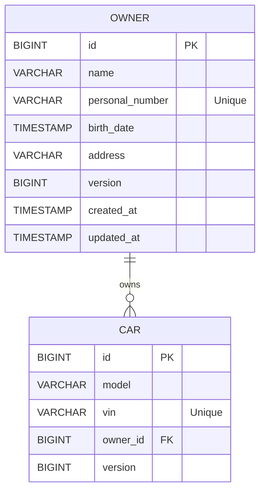

# Owner/Car CRUD Application


This is a Spring boot service which allows management of owners and cars.

## Technologies Used
- Java 21
- Spring Boot 3.5 (with Virtual Threads)
- Maven enforcer plugin for maven [3.9.0,)
- Maven spotless plugin for code style
- Docker maven plugin for building docker images and Integration testing
- Spring Data JPA
- H2 in-memory database
- JWT for authentication
- Spring Security
- Swagger UI for API documentation
- JUnit 5 for unit testing and Spring Boot Tests
- Mockito for mocking in tests and MockMvc for testing controllers
- Flyway for database versioning and migrations
- K6 for load testing
- Grafana for load test results visualization
- Lombok & MapStruct for code generation
- JsonPath for testing JSON responses
- Micrometer for metrics and prometheus exporter


## Swagger UI

Swagger UI is available at:
```
http://localhost:8080/swagger-ui/index.html
```

It supports also authentication in the UI.
The following credentials can be used to authenticate with a **WRITE** role:
```
{
  "username": "sorin",
  "password": "pass123"
}
````


## Entity diagram and relationships




## Github actions and apt
- Github actions are used for CI/CD.
- Usually the workflow is triggered on push to the main branch or on pull request.
- However, we can still run the workflow manually through **act** (brew install act) with the following command:
```
act
```

This will trigger the workflow and run all the steps defined in the **.github/workflows/ci.ym** file.

### Act running the github actions workflow


### Act completing the workflow


## K6 load testing

- K6 is used for load testing the application.
You can simply run it with the following command:
```
docker-compose up --build
```

For example, we hit **15k requests per second** with 50 virtual users for 60 seconds with a **p95** of **7.72ms**


## Grafana Dashboard
- The Grafana dashboard is available at:
```
http://localhost:3000/d/k6/k6-load-testing-results?orgId=1&refresh=5s
```

This is an example dashboard that shows the results of the load tests run by K6.


## Other considerations and improvements
- Use of Webflux for reactive programming and a better performance and scalability.  
However this enforces the use of a reactive database like H2 R2DBC and also increases the overall complexity of the application with Flux/Mono and subscription management.

- Use of code generation tools like OpenAPI Generator to generate the API client and server stubs. This can help to ensure that the API is well-defined and can be easily consumed by clients. However, it also increases the complexity of the build process and requires additional configuration.

- Add a K8s deployment configuration to deploy the application through helm to a Kubernetes cluster. This can help to ensure that the application is scalable and can be easily managed in a production environment.
This should involve a replicaSet, HPA, and a service to expose the application.

