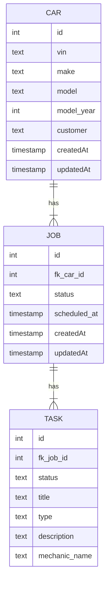

# Basic Repair Shop Management Service

This is Spring boot service which allows management of jobs & tasks within a repair shop.

## DB Diagram

```mermaid
erDiagram
    CAR ||--|{ JOB : has
    CAR {
        int id
        text vin
        text make
        text model
        int model_year
        text customer
        timestamp createdAt
        timestamp updatedAt
    }
    JOB ||--|{ TASK : has
    JOB {
        int id
        int fk_car_id
        text status
        timestamp scheduled_at
        timestamp createdAt
        timestamp updatedAt
    }
    TASK {
        int id
        int fk_job_id
        text status
        text title
        text type
        text description
        text mechanic_name
    }
```
