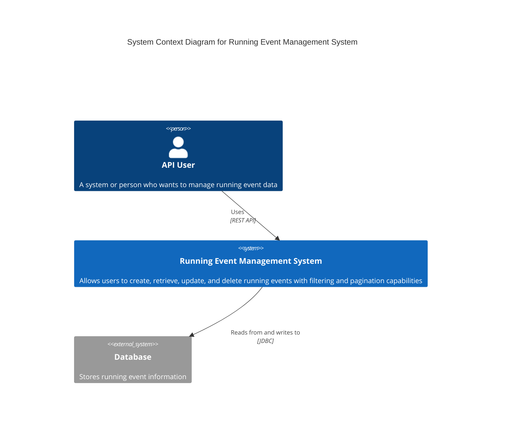
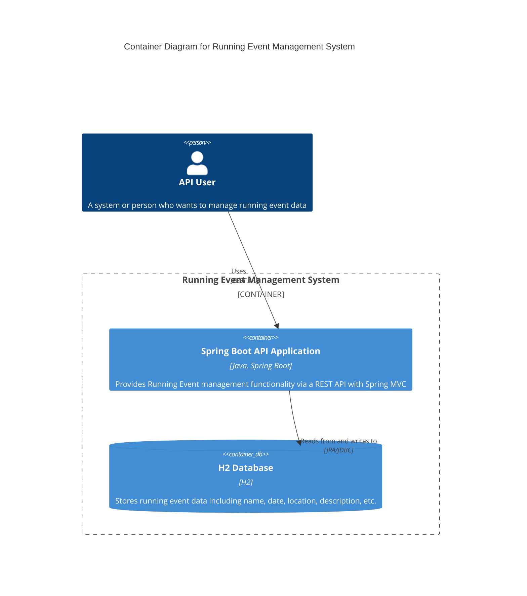
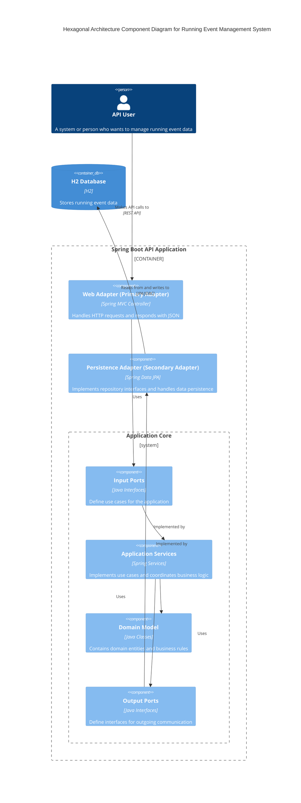

# Running Event Management System

A RESTful API service for managing running events built using Spring Boot and Hexagonal Architecture.

## Architecture Diagrams

### System Context Diagram



### Container Diagram



### Hexagonal Architecture Component Diagram



### Class Diagram (Key Components)

```mermaid
classDiagram
    %% Domain layer
    class RunningEvent {
        -Long id
        -String name
        -Long dateTime
        -String location
        -String description
        -String furtherInformation
        +boolean isValid()
        +Instant getDateTimeAsInstant()
    }
    
    %% Application layer - Input ports
    class CreateRunningEventUseCase {
        <<interface>>
        +RunningEvent createRunningEvent(RunningEvent runningEvent)
    }
    
    class GetRunningEventUseCase {
        <<interface>>
        +Optional~RunningEvent~ getRunningEventById(Long id)
    }
    
    class ListRunningEventsUseCase {
        <<interface>>
        +PaginatedResult~RunningEvent~ listRunningEvents(RunningEventQuery query)
    }
    
    class UpdateRunningEventUseCase {
        <<interface>>
        +Optional~RunningEvent~ updateRunningEvent(RunningEvent runningEvent)
    }
    
    class DeleteRunningEventUseCase {
        <<interface>>
        +boolean deleteRunningEvent(Long id)
    }
    
    %% Application layer - Service
    class RunningEventService {
        -RunningEventRepository runningEventRepository
        +RunningEvent createRunningEvent(RunningEvent runningEvent)
        +Optional~RunningEvent~ getRunningEventById(Long id)
        +PaginatedResult~RunningEvent~ listRunningEvents(RunningEventQuery query)
        +Optional~RunningEvent~ updateRunningEvent(RunningEvent runningEvent)
        +boolean deleteRunningEvent(Long id)
        -void validateRunningEvent(RunningEvent runningEvent)
        -void validateQuery(RunningEventQuery query)
    }
    
    %% Application layer - Output port
    class RunningEventRepository {
        <<interface>>
        +RunningEvent save(RunningEvent runningEvent)
        +Optional~RunningEvent~ findById(Long id)
        +PaginatedResult~RunningEvent~ findAll(RunningEventQuery query)
        +boolean deleteById(Long id)
        +boolean existsById(Long id)
    }
    
    RunningEventService ..|> CreateRunningEventUseCase
    RunningEventService ..|> GetRunningEventUseCase
    RunningEventService ..|> ListRunningEventsUseCase
    RunningEventService ..|> UpdateRunningEventUseCase
    RunningEventService ..|> DeleteRunningEventUseCase
    
    RunningEventService --> RunningEventRepository : uses
    RunningEventService --> RunningEvent : uses
```



## Project Overview

The Running Event Management System is designed to allow users to create, view, update, and delete running events. The system provides a comprehensive set of features including:

- Full CRUD operations for running events
- Filtering events by date range
- Sorting events by different fields (date, name, etc.)
- Pagination support
- Data validation
- Error handling
- API documentation with OpenAPI/Swagger

## Technology Stack

- **Java 21**
- **Spring Boot 3.2.3**
- **Spring Data JPA**
- **H2 Database** (in-memory)
- **Flyway** (for database migrations)
- **SpringDoc OpenAPI** (for API documentation)
- **JUnit 5** (for testing)
- **Lombok** (for reducing boilerplate code)
- **Maven** (for build and dependency management)
- **Spring Validation** (for bean validation)
- **Virtual Threads** (for improved performance)

## Architecture

This application follows the **Hexagonal Architecture** (also known as Ports and Adapters) pattern, which emphasizes separation of concerns and independence from external systems. The application is divided into three main layers:

### 1. Domain Layer

- Contains the core business entities (`RunningEvent`)
- Encapsulates the business logic and validation rules
- Independent of external systems and frameworks

### 2. Application Layer

- Houses the use cases (service implementations)
- Defines the ports (interfaces) for communicating with external systems
- Coordinates the execution of business logic
- Use case interfaces:
    - `CreateRunningEventUseCase`
    - `GetRunningEventUseCase`
    - `ListRunningEventsUseCase`
    - `UpdateRunningEventUseCase`
    - `DeleteRunningEventUseCase`

### 3. Infrastructure Layer

- Contains adapters for external systems
- Implements the port interfaces defined in the application layer
- Includes:
    - Web adapters (controllers, DTOs)
    - Persistence adapters (repositories, entities)
    - Configuration (Spring Boot config, OpenAPI, etc.)

### Benefits of Hexagonal Architecture

- **Testability**: Business logic can be tested in isolation
- **Flexibility**: External systems can be replaced without affecting core business logic
- **Maintainability**: Clear separation of concerns
- **Scalability**: Components can evolve independently

## Setup Instructions

### Prerequisites

- JDK 21 or later
- Maven 3.6 or later
- Git (optional, for cloning the repository)

### Building the Application

```bash
# Clone the repository (if not already done)
git clone https://github.com/lgtm-tyvm/interview
cd backend

# Build the application
./mvnw clean package
```

### Running the Application

```bash
# Run with Maven
./mvnw spring-boot:run

# Or run the JAR file directly
java -jar target/interview-1.0-SNAPSHOT.jar
```

The application will start on port 8080 by default. You can access it at `http://localhost:8080`.

### Running with Docker

```bash
# Build the Docker image
docker build -t running-events-api .

# Run the container
docker run -p 8080:8080 running-events-api

# Alternatively, use Docker Compose
docker-compose up
```

### Accessing the H2 Console

While the application is running, you can access the H2 database console:

1. Navigate to: `http://localhost:8080/h2-console`
2. Use the following connection details:
    - JDBC URL: `jdbc:h2:mem:runningeventsdb`
    - Username: `sa`
    - Password: `password`

### Accessing the Swagger UI

The API documentation is available via Swagger UI:

1. Navigate to: `http://localhost:8080/swagger-ui.html`
2. This provides an interactive UI to explore and test all available endpoints

## API Documentation

### Endpoints

| Method | Endpoint              | Description                                           |
|--------|------------------------|-------------------------------------------------------|
| GET    | `/api/events`          | List all running events (with optional filters)       |
| GET    | `/api/events/{id}`     | Get a specific running event by ID                    |
| POST   | `/api/events`          | Create a new running event                            |
| PUT    | `/api/events/{id}`     | Update an existing running event                      |
| DELETE | `/api/events/{id}`     | Delete a running event                                |

### Query Parameters for GET `/api/events`

| Parameter     | Description                                           | Default Value |
|---------------|-------------------------------------------------------|---------------|
| `fromDate`    | Filter events with date >= fromDate (yyyy-MM-ddTHH:mm) | (none)        |
| `toDate`      | Filter events with date <= toDate (yyyy-MM-ddTHH:mm)   | (none)        |
| `page`        | Page number (0-based)                                 | 0             |
| `size`        | Number of items per page                              | 20            |
| `sortBy`      | Field to sort by (`id``, `name`, `dateTime`) | `dateTime` |
| `sortDir`     | Sort direction (`ASC` or `DESC`)                   | `ASC`         |

### Example Requests and Responses

#### Create a Running Event

**Request:**

```bash
curl -X POST http://localhost:8080/api/events \
  -H "Content-Type: application/json" \
  -d '{
    "name": "Summer Marathon 2025",
    "dateTime": "2025-07-15T09:00",
    "location": "Central Park, New York",
    "description": "Annual summer marathon through scenic Central Park",
    "furtherInformation": "Water stations every 2 miles. Registration closes 2 weeks before event."
  }'
```

**Response:**

```json
{
  "id": 1,
  "name": "Summer Marathon 2025",
  "dateTime": "2025-07-15T09:00",
  "location": "Central Park, New York",
  "description": "Annual summer marathon through scenic Central Park",
  "furtherInformation": "Water stations every 2 miles. Registration closes 2 weeks before event."
}
```

#### Get a Running Event

**Request:**

```bash
curl -X GET http://localhost:8080/api/events/1
```

**Response:**

```json
{
  "id": 1,
  "name": "Summer Marathon 2025",
  "dateTime": "2025-07-15T09:00",
  "location": "Central Park, New York",
  "description": "Annual summer marathon through scenic Central Park",
  "furtherInformation": "Water stations every 2 miles. Registration closes 2 weeks before event."
}
```

#### List Running Events (with filtering and pagination)

**Request:**

```bash
curl -X GET "http://localhost:8080/api/events?fromDate=2025-06-01T00:00&toDate=2025-08-31T23:59&page=0&size=10&sortBy=dateTime&sortDir=ASC"
```

**Response:**

```json
{
  "items": [
    {
      "id": 1,
      "name": "Summer Marathon 2025",
      "dateTime": "2025-07-15T09:00",
      "location": "Central Park, New York",
      "description": "Annual summer marathon through scenic Central Park",
      "furtherInformation": "Water stations every 2 miles. Registration closes 2 weeks before event."
    }
  ],
  "totalItems": 1,
  "page": 0,
  "pageSize": 10,
  "totalPages": 1,
  "hasPrevious": false,
  "hasNext": false
}
```

#### Update a Running Event

**Request:**

```bash
curl -X PUT http://localhost:8080/api/events/1 \
  -H "Content-Type: application/json" \
  -d '{
    "name": "Summer Marathon 2025 - Updated",
    "dateTime": "2025-07-16T10:00",
    "location": "Central Park, New York",
    "description": "Annual summer marathon through scenic Central Park - Updated details",
    "furtherInformation": "Water stations every mile. Registration closes 3 weeks before event."
  }'
```

**Response:**

```json
{
  "id": 1,
  "name": "Summer Marathon 2025 - Updated",
  "dateTime": "2025-07-16T10:00",
  "location": "Central Park, New York",
  "description": "Annual summer marathon through scenic Central Park - Updated details",
  "furtherInformation": "Water stations every mile. Registration closes 3 weeks before event."
}
```

#### Delete a Running Event

**Request:**

```bash
curl -X DELETE http://localhost:8080/api/events/1
```

**Response:**

```
204 No Content
```

## Testing

The application includes extensive test coverage at multiple levels:

### Unit Tests

Test individual components in isolation:
- Domain model tests
- Service tests
- Repository tests
- Controller tests
- DTO mapping tests

### Integration Tests

Test component interactions:
- Repository integration tests
- Service integration tests
- Controller integration tests
- Database migration tests

### Running Tests

```bash
# Run all tests
./mvnw test

# Run specific test
./mvnw test -Dtest=RunningEventServiceTest

# Run integration tests only
./mvnw test -Dtest=*IntegrationTest

# Run migration tests
./mvnw test -P migration-test
```

## Additional Notes

### Validation

The API performs comprehensive validation:
- Required fields: name, dateTime, location
- Field length restrictions
- Date format validation
- Business rule validation (e.g., event date must be in the future)

### Error Handling

Standardized error responses are provided for various scenarios:
- Invalid input data (400 Bad Request)
- Resource not found (404 Not Found)
- Server errors (500 Internal Server Error)

Example error response:

```json
{
  "status": 400,
  "error": "Bad Request",
  "message": "Validation failed. Check 'details' field for more information.",
  "timestamp": 1616661666666,
  "path": "/api/events",
  "details": [
    {
      "field": "name",
      "message": "Name is required"
    },
    {
      "field": "dateTime",
      "message": "Date and time is required"
    }
  ]
}
```

### Virtual Threads

The application uses Java 21 Virtual Threads for improved performance and scalability, allowing it to handle many concurrent requests efficiently.

### Database Migrations

Flyway is used for database migrations, providing version control for database schema changes. Migration scripts are located in `src/main/resources/db/migration/`.