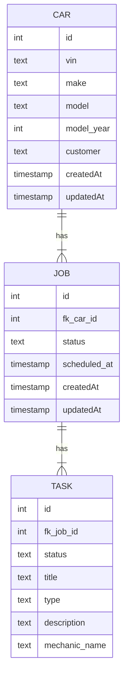

# Basic Repair Shop Management Service

This is Spring boot service which allows management of jobs & tasks within a repair shop.

## Features
- CRUD operations for Jobs and Tasks
- Authentication and authorization using JWT & Spring Security
- Pagination, filtering and sorting for Jobs
- Metrics & Tracing
- DB Schema migrations
- API Documentation in Swagger & OpenAPI

## Tech Stack

- Java 21
- Spring Boot 3
- Spring Data JPA
- H2 Database
- Flyway (schema migration)
- Lombok & MapStruct (for reducing boilerplate)
- Zipkin (distributed tracing)
- Micrometer Prometheus (exposes application metrics)
- Grafana (for metrics dashboard)
- Spring Boot Test

## Setup for local dev

Can be found [here](SETUP_LOCAL_DEV.md)

## DB Diagram

## API

The API allows CRUD operations on jobs and tasks.

For jobs we have the following endpoints: 

| Endpoint Path          | Allowed Methods  | Description                                                                            | Required role |
|------------------------|------------------|----------------------------------------------------------------------------------------|---------------|
| /api/v1/jobs/{id}      | GET, PUT, DELETE | Allows reading, updating and deleting a job by id.                                     | ADMIN         |
| /api/v1/jobs           | POST             | Create a new job using JSON Request Body, a car is also created if id is not specified | ADMIN         |
| /api/v1/jobs           | GET              | Find all jobs with pagination and optional status filtering                            | ADMIN         |
| /api/v1/jobs/car/{vin} | GET              | Find all jobs by car VIN                                                               | USER or ADMIN |

For tasks we have the following endpoints:

| Endpoint Path          | Allowed Methods  | Description                                         | Required role |
|------------------------|------------------|-----------------------------------------------------|---------------|
| /api/v1/tasks/{id}     | GET, PUT, DELETE | Allows reading, updating and deleting a task by id. | ADMIN         |
| /api/v1/jobs           | POST             | Create a new task using JSON Request Body           | ADMIN         |

A CRUD for car entity is not offered. A car is created automatically when a job is created.

### Swagger
Swagger can be accessed at http://localhost:8080/swagger-ui/index.html.

In addition, the OpenAPI specs are found at: http://localhost:8080/v3/api-docs

## Security

This application leverages Spring Security with OAuth2 Resource Server capabilities to secure its endpoints. 

It relies on JWT (JSON Web Tokens) for authentication and role-based authorization.

### Authentication

All requests except initial resource found at `/api/welcome` are required to provide a valid JWT in `Authorization` header.

The service will validate the JWT signature using the public key found at `resources/keys/public.pem` directory.

***Note***: for production we would configure an external Authorization Provider (okta, google etc.) to obtain the keys from. 

### Authorization

Role-based authorization is set up such that the server will read roles from JWT claim `roles`.

We use method-level security on the endpoints using `@PreAuthorize("hasRole({ROLE})")` to enforce that a user needs to have a specific role (ADMIN or USER) in order to access those resources.

## Database migration

We use flyway to manage database migrations. The scripts can be found at `src/main/resouces/database/migration`.