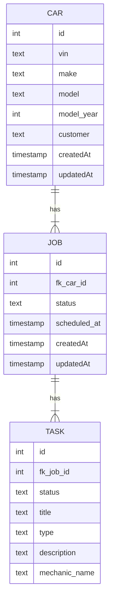

# Basic Repair Shop Management Service

This is Spring boot service which allows management of jobs & tasks within a repair shop.

## DB Diagram

## API

TODO 

## Setup for local dev

TODO

## Security

Spring security is configured with OAuth2 support.

### Authentication

All requests except initial resource found at `/api/welcome` are required to provide a valid JWT in `Authorization` header.
The service will validate the JWT signature using the public key found at `resources/keys/public.pem` directory.

***Note***: for production we would configure an external Authorization Provider (okta, google etc.) to obtain the keys from. 

### Authorization

Role-based authorization is set up such that the server will read roles from JWT claim `roles`.
We use method-level security on the endpoints using `@PreAuthorize("hasRole({ROLE})")` to enforce that a user needs to have a specific role (ADMIN or USER) in order to access those resources.
