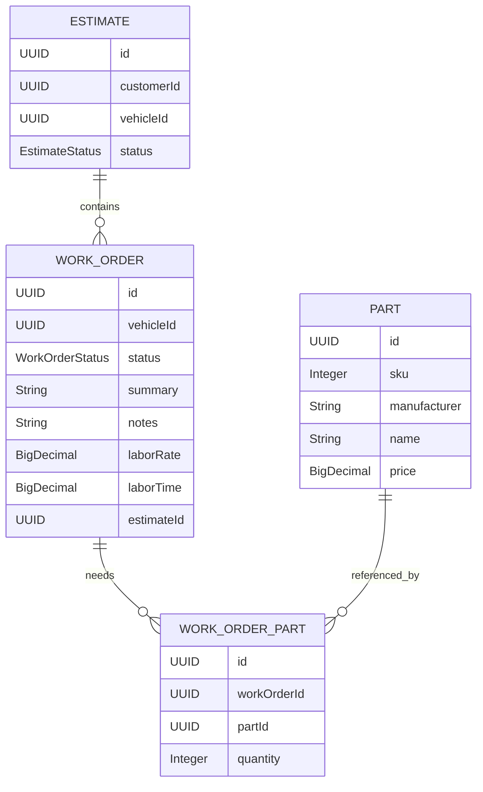
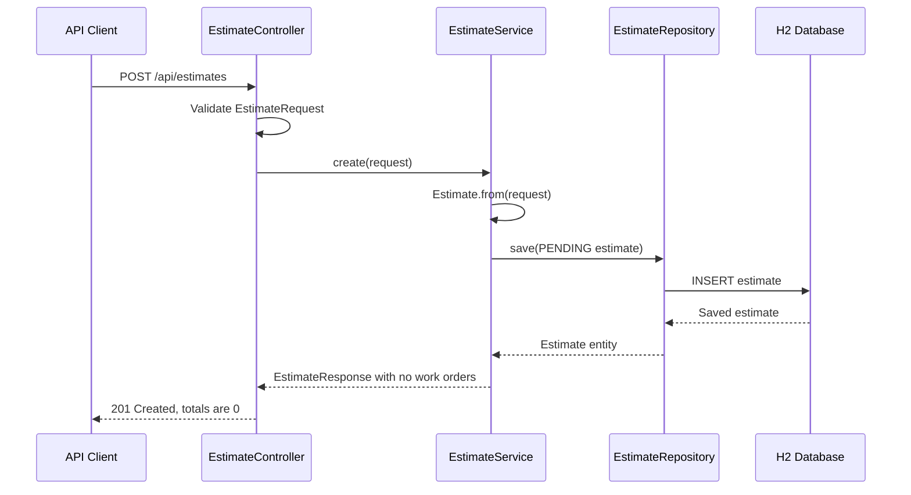
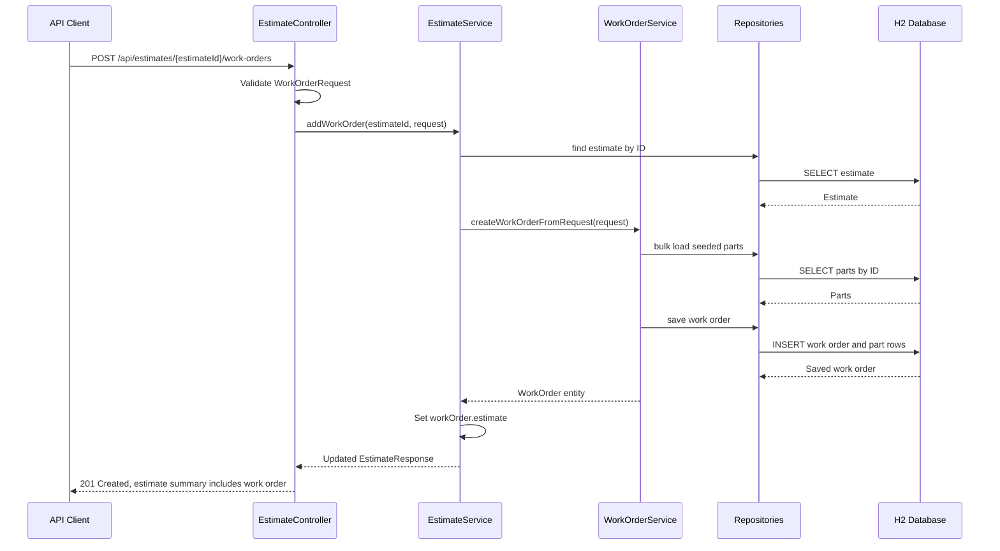
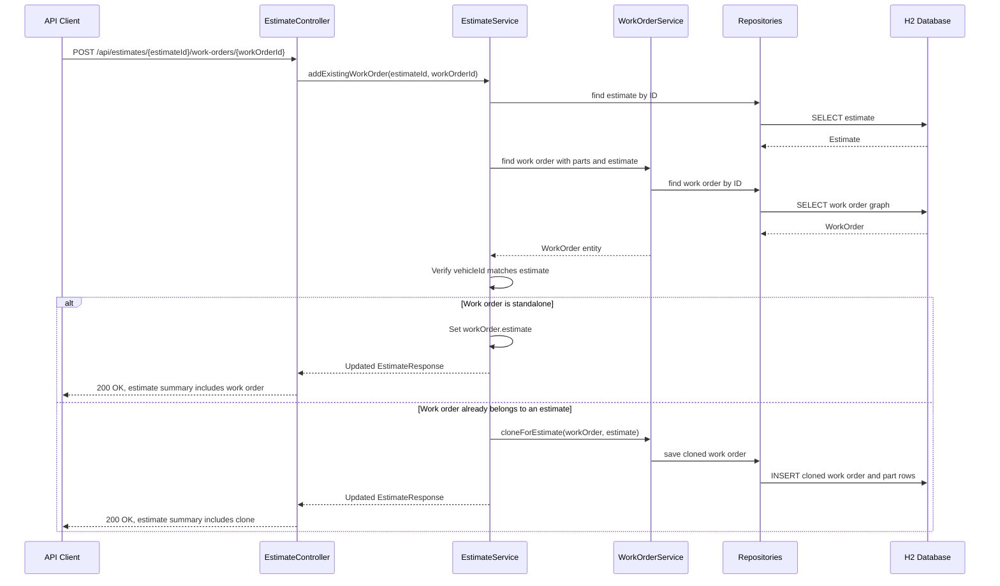

# Tekmetric Estimate Builder API

This is a Spring Boot CRUD API for a simplified auto repair estimate builder. It models estimates, work orders, and seeded parts so a technician can create an estimate first, then add labor and parts as work orders are diagnosed.

## Tech Stack

- Java 26
- Spring Boot 4.0.6
- Spring Web
- Spring Data JPA
- Jakarta Bean Validation
- H2 in-memory database
- Lombok
- Springdoc OpenAPI and Swagger UI
- JUnit, Mockito, and MockMvc

## JVM Setup

This project targets Homebrew OpenJDK. If `java -version` does not work, expose the Homebrew JDK in your shell:

```zsh
export JAVA_HOME=/opt/homebrew/opt/openjdk/libexec/openjdk.jdk/Contents/Home
export PATH="$JAVA_HOME/bin:$PATH"
```

## Run The App

```zsh
mvn spring-boot:run
```

Health check:

```zsh
curl http://localhost:8080/api/health
```

Swagger UI:

- http://localhost:8080/swagger-ui.html

OpenAPI JSON:

- http://localhost:8080/v3/api-docs

Postman collection:

- `postman/Tekmetric Estimate Builder API.postman_collection.json`

## Run Tests

```zsh
mvn test
```

## H2 Console

- URL: http://localhost:8080/h2-console
- JDBC URL: `jdbc:h2:mem:testdb`
- Username: `sa`
- Password: `password`

The schema and seed data live in `src/main/resources/database/data.sql`.

## Application Properties

- `spring.jpa.hibernate.ddl-auto=none`: Hibernate will not create or update tables; the SQL script owns schema setup.
- `spring.jpa.open-in-view=false`: prevents lazy database access during controller response serialization.
- `spring.sql.init.mode=always`: Spring runs SQL initialization every time the in-memory database starts.
- `spring.sql.init.schema-locations=classpath:database/data.sql`: points Spring at the schema/seed file.
- `spring.sql.init.continue-on-error=false`: startup fails if the SQL script has a problem.
- `springdoc.api-docs.path=/v3/api-docs`: serves the generated OpenAPI JSON document.
- `springdoc.swagger-ui.path=/swagger-ui.html`: serves the Swagger UI page.
- `spring.jpa.defer-datasource-initialization=false`: SQL initialization runs during normal datasource startup.
- `spring.h2.console.enabled=true`: enables the browser-based H2 console for local debugging.

In SQL, `CONSTRAINT` names a database rule such as a foreign key, uniqueness rule, enum-like check, or positive-value check. Named constraints make schema intent and database errors easier to understand.

## Domain Rules

- Parts are seeded reference data and include `price`.
- Work orders include `summary`, `notes`, labor rate, labor time, status, and needed parts.
- Work-order updates do not change `vehicleId`; vehicle identity is set only when the work order is created.
- A work order belongs to zero or one estimate; standalone work orders have no associated estimate.
- Associating an unowned existing work order attaches it to the target estimate.
- Associating an already-owned work order clones it and attaches the clone to the target estimate.
- A work order can only be associated with an estimate for the same `vehicleId`.
- A work order can require multiple quantities of the same part through `quantity`; duplicate part IDs in a request are consolidated.
- Work order `totalCost` is calculated as `(laborTime * laborRate) + sum(part.price * quantity)`.
- Work orders can be labor-only; `partsNeeded` may be empty.
- Estimate `totalCost` and `totalTime` include only work orders that are not `REFUSED`.
- Estimate responses include work-order summaries, but not nested part details.
- Work order detail responses include parts needed.
- Work order responses include `estimateUrl`, using `/api/estimates/{estimateId}` when associated and `null` when standalone.
- API timestamps use `Instant` so responses include an unambiguous UTC timestamp.
- Work order lists sort `REFUSED` work orders to the bottom.
- API requests and responses use DTOs, not raw JPA entities.

## Entity Relationships


```mermaid
erDiagram
    ESTIMATE ||--o{ WORK_ORDER : contains
    WORK_ORDER ||--o{ WORK_ORDER_PART : needs
    PART ||--o{ WORK_ORDER_PART : referenced_by

    ESTIMATE {
      UUID id
      UUID customerId
      UUID vehicleId
      EstimateStatus status
    }

    WORK_ORDER {
      UUID id
      UUID vehicleId
      WorkOrderStatus status
      String summary
      String notes
      BigDecimal laborRate
      BigDecimal laborTime
      UUID estimateId
    }

    PART {
      UUID id
      Integer sku
      String manufacturer
      String name
      BigDecimal price
    }
    WORK_ORDER_PART {
      UUID id
      UUID workOrderId
      UUID partId
      Integer quantity
    }
```

## User Flows

### Create An Empty Estimate


```mermaid
sequenceDiagram
    participant Client as API Client
    participant Controller as EstimateController
    participant Service as EstimateService
    participant Repository as EstimateRepository
    participant Database as H2 Database

    Client->>Controller: POST /api/estimates
    Controller->>Controller: Validate EstimateRequest
    Controller->>Service: create(request)
    Service->>Service: Estimate.from(request)
    Service->>Repository: save(PENDING estimate)
    Repository->>Database: INSERT estimate
    Database-->>Repository: Saved estimate
    Repository-->>Service: Estimate entity
    Service-->>Controller: EstimateResponse with no work orders
    Controller-->>Client: 201 Created, totals are 0
```

### Create And Attach A New Work Order


```mermaid
sequenceDiagram
    participant Client as API Client
    participant Controller as EstimateController
    participant EstimateService as EstimateService
    participant WorkOrderService as WorkOrderService
    participant Repositories as Repositories
    participant Database as H2 Database

    Client->>Controller: POST /api/estimates/{estimateId}/work-orders
    Controller->>Controller: Validate WorkOrderRequest
    Controller->>EstimateService: addWorkOrder(estimateId, request)
    EstimateService->>Repositories: find estimate by ID
    Repositories->>Database: SELECT estimate
    Database-->>Repositories: Estimate
    EstimateService->>WorkOrderService: createWorkOrderFromRequest(request)
    WorkOrderService->>Repositories: bulk load seeded parts
    Repositories->>Database: SELECT parts by ID
    Database-->>Repositories: Parts
    WorkOrderService->>Repositories: save work order
    Repositories->>Database: INSERT work order and part rows
    Database-->>Repositories: Saved work order
    WorkOrderService-->>EstimateService: WorkOrder entity
    EstimateService->>EstimateService: Set workOrder.estimate
    EstimateService-->>Controller: Updated EstimateResponse
    Controller-->>Client: 201 Created, estimate summary includes work order
```

### Associate An Existing Work Order


```mermaid
sequenceDiagram
    participant Client as API Client
    participant Controller as EstimateController
    participant EstimateService as EstimateService
    participant WorkOrderService as WorkOrderService
    participant Repositories as Repositories
    participant Database as H2 Database

    Client->>Controller: POST /api/estimates/{estimateId}/work-orders/{workOrderId}
    Controller->>EstimateService: addExistingWorkOrder(estimateId, workOrderId)
    EstimateService->>Repositories: find estimate by ID
    Repositories->>Database: SELECT estimate
    Database-->>Repositories: Estimate
    EstimateService->>WorkOrderService: find work order with parts and estimate
    WorkOrderService->>Repositories: find work order by ID
    Repositories->>Database: SELECT work order graph
    Database-->>Repositories: WorkOrder
    WorkOrderService-->>EstimateService: WorkOrder entity
    EstimateService->>EstimateService: Verify vehicleId matches estimate
    alt Work order is standalone
        EstimateService->>EstimateService: Set workOrder.estimate
        EstimateService-->>Controller: Updated EstimateResponse
        Controller-->>Client: 200 OK, estimate summary includes work order
    else Work order already belongs to an estimate
        EstimateService->>WorkOrderService: cloneForEstimate(workOrder, estimate)
        WorkOrderService->>Repositories: save cloned work order
        Repositories->>Database: INSERT cloned work order and part rows
        EstimateService-->>Controller: Updated EstimateResponse
        Controller-->>Client: 200 OK, estimate summary includes clone
    end
```

## Endpoints

### Health

```http
GET /api/health
```

### Work Orders

```http
POST /api/work-orders
GET /api/work-orders/{id}
GET /api/work-orders?page=0&size=20&status=PENDING
PUT /api/work-orders/{id}
DELETE /api/work-orders/{id}
```

### Estimates

```http
POST /api/estimates
POST /api/estimates/{estimateId}/work-orders
POST /api/estimates/{estimateId}/work-orders/{workOrderId}
GET /api/estimates/{id}
GET /api/estimates?page=0&size=20&customerId={uuid}&status=PENDING
PUT /api/estimates/{id}
DELETE /api/estimates/{id}
```

Estimate creation intentionally starts without work orders. Customer and vehicle identity are set when the estimate is
created; later updates only accept `status`. Work orders can be created and associated through the nested work-order
endpoint, or one existing work order can be associated at a time. If that existing work order already belongs to an
estimate, the API creates a clone for the target estimate instead of moving the original.

## Example Demo Flow

### Seeded Reference Parts

Parts are seeded reference data, not a public API resource. Use these IDs in work-order `partsNeeded` requests:

| Part ID | SKU | Manufacturer | Name | Price |
| --- | ---: | --- | --- | ---: |
| `11111111-1111-1111-1111-111111111111` | 41001 | Bosch | QuietCast Brake Pad Set | 89.99 |
| `22222222-2222-2222-2222-222222222222` | 41002 | Denso | Iridium Spark Plug | 12.50 |
| `33333333-3333-3333-3333-333333333333` | 41003 | Gates | Serpentine Belt | 44.75 |
| `44444444-4444-4444-4444-444444444444` | 41004 | Wix | Engine Oil Filter | 13.99 |
| `55555555-5555-5555-5555-555555555555` | 41005 | Monroe | Quick-Strut Assembly | 219.95 |

Create an empty estimate:

```zsh
curl -X POST http://localhost:8080/api/estimates \
  -H 'Content-Type: application/json' \
  -d '{
    "customerId": "12121212-1212-1212-1212-121212121212",
    "vehicleId": "99999999-9999-9999-9999-999999999999"
  }'
```

Create a standalone work order:

```zsh
curl -X POST http://localhost:8080/api/work-orders \
  -H 'Content-Type: application/json' \
  -d '{
    "vehicleId": "99999999-9999-9999-9999-999999999999",
    "status": "PENDING",
    "summary": "Replace front brake pads",
    "notes": "Pads are worn below recommended thickness.",
    "laborRate": 100.00,
    "laborTime": 2.00,
    "partsNeeded": [
      { "partId": "11111111-1111-1111-1111-111111111111", "quantity": 2 }
    ]
  }'
```

Create and attach a new work order to an estimate:

```zsh
curl -X POST http://localhost:8080/api/estimates/{estimateId}/work-orders \
  -H 'Content-Type: application/json' \
  -d '{
    "vehicleId": "99999999-9999-9999-9999-999999999999",
    "status": "PENDING",
    "summary": "Replace front brake pads",
    "notes": "Pads are worn below recommended thickness.",
    "laborRate": 100.00,
    "laborTime": 2.00,
    "partsNeeded": [
      { "partId": "11111111-1111-1111-1111-111111111111", "quantity": 2 }
    ]
  }'
```

Filter estimates:

```zsh
curl 'http://localhost:8080/api/estimates?customerId=12121212-1212-1212-1212-121212121212&status=PENDING&page=0&size=10'
```

## Error Handling And Debugging

Known failures return a consistent error shape with a timestamp, status, message, and field-level validation details when available. Validation covers required IDs, enum values, positive labor values, part quantities, pagination bounds, missing resources, and invalid references.

Create, update, and delete flows add relevant IDs to MDC, such as `estimateId`, `workOrderId`, and `partId`, so request logs are easier to correlate during debugging.
