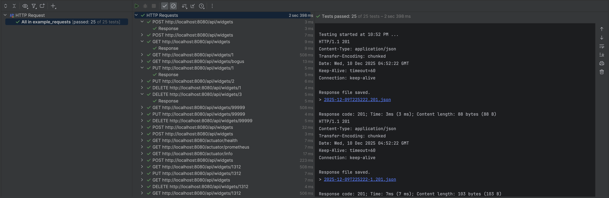

# TekMetric Interview Submission
### Submission By: Jason Norman
Welcome to my TekMetric interview branch! Here I will discuss the various decisions and techniques applied to this PR.

The functionality demo is done in several ways. Through unit tests, some scripts, and interactively via [example_requests.http](example_requests.http), which can be executed within IntelliJ with the following results.

# Database Transactionality 
This was identified as an important topic during my TekMetric conversation. In response to this I have implemented a transactional service layer with optimistic locking and rollback verification. This offers an alternative to the "last-write-wins" problem and ensures write errors rollback correctly. There are [tests](src/test/java/com/interview/TransactionalityTest.java) to prove these mechanisms are working.

# Mindset & Perspective
To demonstrate architectural mindset and aptitude, I have structured this project to follow the [Command/Query Responsibility Segregation (CQRS) pattern](https://learn.microsoft.com/en-us/azure/architecture/patterns/cqrs). This pattern allows for nuanced performance tuning, and even decoupling of reads from writes entirely, both of which have inherently different performance characteristics. At scale it is often advantageous to have separate data models or even infrastructure for read and write operations to maximize efficiency. To simulate this, I have created two database configurations, one for reads (`query`) and the other for writes (`command`).

I have implemented [Spring-Modulith](https://spring.io/projects/spring-modulith) to facilitate this pattern in two ways. First, define and manage three discrete code-level modules, one for query operations, one for write operations, and one for common code between the two. This is done via the `package-info.java` file at the root of each module. These modules are well-encapsulated and visibility between them is limited only to the contracts defined by Spring-Modulith. In a real-world scenario there would likely be more modules with finer grained purpose, but for this example, `query`, `command`, and `common` are adequate to illustrate the concept.

The second goal of using Spring-Modulith for this purpose is the use of its application domain events mechanism. The physical decoupling of read and write infrastructure creates a data synchronization problem. Something must update the state of data on the read side when data on the write side is modified. To solve this, I have leveraged [Modulith domain events](src/main/kotlin/com/interview/common/events/ApplicationDomainEvents.kt), which are sent between modules to facilitate asynchronous integration. These events are also easily externalized to Kafka or similar.

If this application were going to prod, we would not at this point need or want the full physical separation with two databases and domain events, as that would be complexity overkill with no justification. We could still use the module separation though, backed by one database with no synchronization needed, to ease a future refactor to implement this optimization. Think of it as pre-paying a tech debt while receiving dividends in the short term, as CQRS is also a good pattern for code clarity and semantic intent, even if you are not sure you will need full decoupling. There are [tests](src/test/java/com/interview/ModulithTest.java) and [a comment](src/main/java/com/interview/command/controller/WidgetCommandController.java) (line 44) with instructions for demonstrating Modulith’s module visibility protections.

# Depth and Expertise
To demonstrate subject matter expertise, I have also implemented the [read-through](https://www.enjoyalgorithms.com/blog/read-through-caching-strategy) caching pattern in this project using Spring-Cache. This style of implementation uses Spring’s cache abstraction annotations, alongside Caffeine in-memory cache provider. Along with this implementation is [a test](src/test/java/com/interview/CachingTest.java) proving the cache works and provides improved latency opposed to the database. This implementation can be easily extended into a [near-cache pattern](https://docs.oracle.com/cd/E13924_01/coh.340/e13819/nearcache.htm), by utilizing a distributed provider (appropriate for microservices) such as Hazelcast IMDG, or Redis/Valkey. Ask me about Redisson.

# Poly-gluttonous
To demonstrate mirthful polyglot enthusiasm, I have also added Kotlin as a language for this project. Kotlin has various mechanisms which are syntactically and functionally advantageous over their Java counterparts, and since Kotlin is a fully supported JVM language, it is trivial to add to a project. I also enjoy using Kotlin’s Gradle DSL, though Gradle is not in play here. In this case I am preferring Kotlin’s data class construct over the Java record construct, due to additional features and capabilities such as the copy method, default parameter values, destructuring, improved equals/hashCode/toString implementations, improved interplay with JPA (due to more flexible constructors, explicit nullability, etc), and so on.

# Observability-Driven Development 
As an ODD true-believer and practitioner, I have implemented two telemetry features in this project. First, I have added trace and span ID to the logs. This greatly improves production debugging and troubleshooting, as the trace IDs carry across boundaries so all logs related to an originating request are correlated for easy searching as well as automatic correlation in observability platforms such as Datadog. This can be seen by inspecting the logs as the application is exercised. 

Secondly, I have also added custom metrics, which are collected as the application runs. Every handler class times and counts its operation. These timer/counter metrics are verified in [a test](src/test/java/com/interview/MicrometerMetricsTest.java). If going to prod, we would export these metrics to an external observability platform in order to populate dashboards, notebooks, reports, etc. For the sake of this demo, there is a TestContainers configuration. See [OBSERVABILITY.md](OBSERVABILITY.md) for instructions.