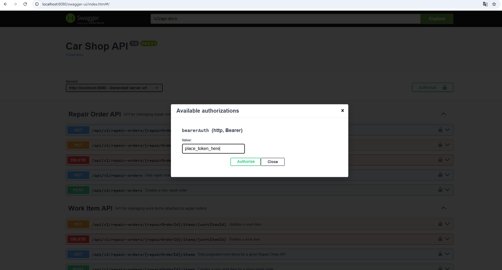
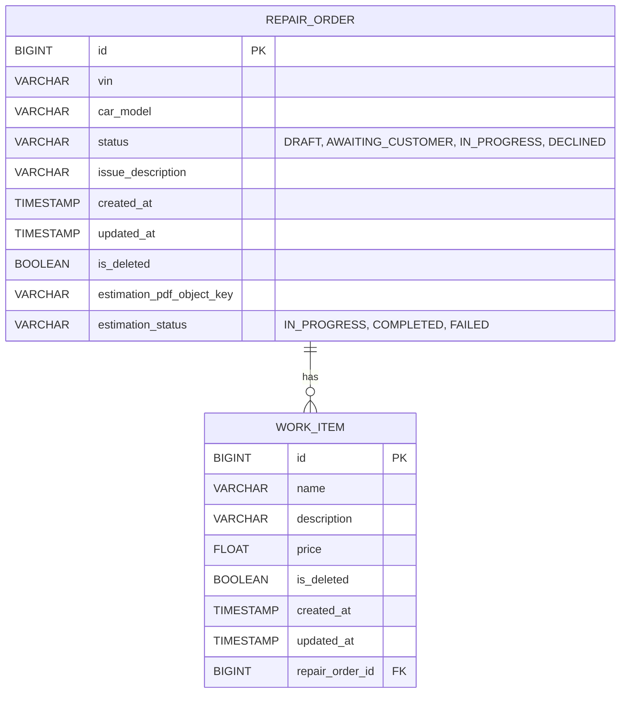
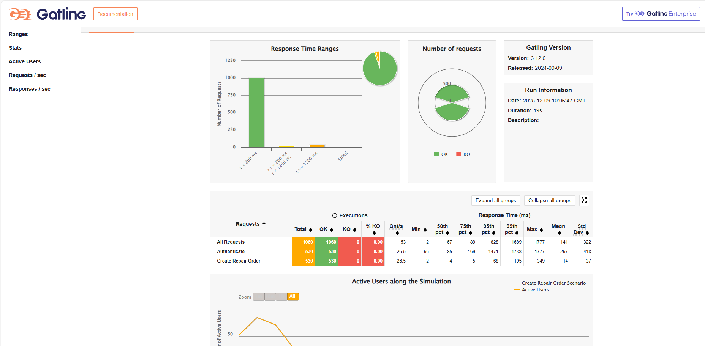
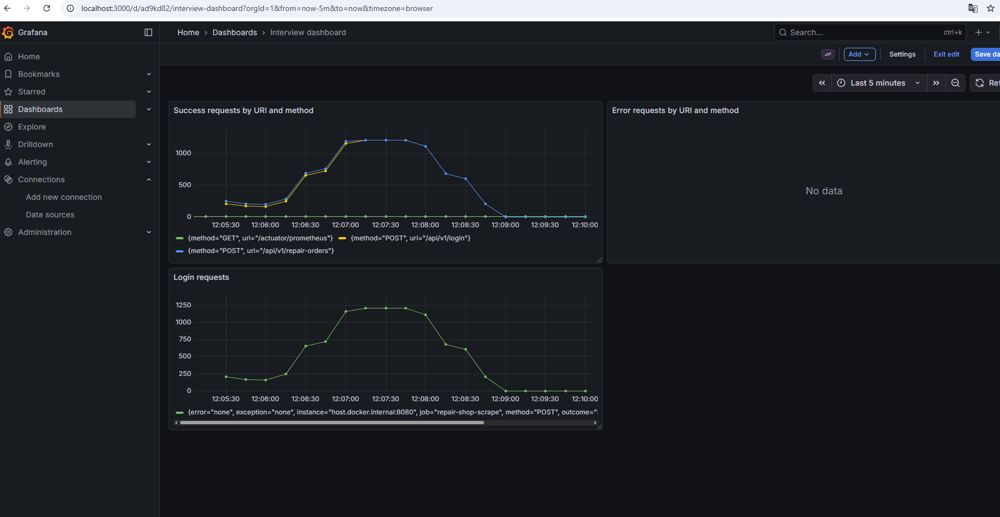

# Repair shop management app

## Technologies used:
- Java 21
- Spring Boot 3.5.7
- Maven
- Spring Data JPA
- Spring Security
- Spring Actuator
- SpringDoc OpenAPI - Swagger (can be used as a client)
- H2 Database
- Flyway - Schema migration
- JWT - For authentication
- iText 9 (PDF handling) - Library for generating PDFs
- MiniIO - Used for storing PDFs and generating presigned URLs, allowing clients to view PDF estimations without requiring authentication
- MinIO Java SDK - Client used to upload pdf files to MinIO (S3 compatible blob storage)
- Docker Compose - Started all dependencies (Prometheus, Grafana, MinIO)
- Micrometer - Exported prometheus metrics
- Prometheus - Metrics collection
- Grafana - Metrics visualisation
- Gatling - Performance testing
- Lombok - Code generation
- Junit 5 & Spring Boot Test for unit and integration tests
- Mockito - Mocking unit tests
- MockMVC - Testing controllers

## API Client Tool:
- Swagger is accessible at: `http://localhost:8080/swagger-ui/index.html`
  - User with STAFF Role: `{
    "username": "John",
    "password": "Test1234!"
  }`
  - User with ADMIN Role: `{
    "username": "Admin",
    "password": "Test1234!"
  }`
- Use the credentials to obtain a token(using `/api/v1/login`) and place the token in swagger:
  

## Problem statement:
This application allows staff to create repair orders,
add multiple work items to a given repair order, generate a PDF (estimate) summary, upload it to blob storage,
and track the PDF generation status via an API.

### Entities diagram

```mermaid
erDiagram
    REPAIR_ORDER {
        BIGINT id PK
        VARCHAR vin
        VARCHAR car_model
        VARCHAR status "DRAFT, AWAITING_CUSTOMER, IN_PROGRESS, DECLINED"
        VARCHAR issue_description
        TIMESTAMP created_at
        TIMESTAMP updated_at
        BOOLEAN is_deleted
        VARCHAR estimation_pdf_object_key
        VARCHAR estimation_status "IN_PROGRESS, COMPLETED, FAILED"
    }
    WORK_ITEM {
        BIGINT id PK
        VARCHAR name
        VARCHAR description
        FLOAT price
        BOOLEAN is_deleted
        TIMESTAMP created_at
        TIMESTAMP updated_at
        BIGINT repair_order_id FK
    }
    REPAIR_ORDER ||--o{ WORK_ITEM : "has"
```

### API
Repair Order Management:
CREATE, READ, UPDATE, DELETE

Service Item Management
CREATE, READ, UPDATE, DELETE (soft delete) of a service item which is part of the repair order

### Running performance test
Start the app and run `mvn verify` in the performance folder.
Results example:

Gatling results

Grafana during load testing counting the number of requests

### Improvements:
- Usage of Dockerfile to containerize the application, enabling it to run consistently across environments
- Security:
  - The security is just an POC. In a real environment we will use a proper user management service (example: OpenID Connect)
- Testing: 
  - Usage of Testcontainers to build integration tests that simulate and verify the application's behavior when working other dependencies (MinIO)
- Data handling:
  - Better use of projections when fetching entities from the Database
  - Introducing EstimationDocument entity to store PDF metadata, enabling multiple files and version tracking for repair orders
- Observability:
  - Adding more dashboards in Grafana
  - In a distributed environment, we will need traces (Spring Cloud Sleuth + Zipkin)
  - Adding alerts (using Prometheus Alertmanager)
- Product:
  - Enable guest users (without an account) to approve or decline a RepairOrder after viewing the estimation PDF, using signed URLs and a public endpoint
- Other improvements:
  - Introduced EstimationDocument entity to store PDF metadata, enabling multiple files and version tracking for repair orders
  - Adding CI support for automatic builds, tests, and code quality checks.
