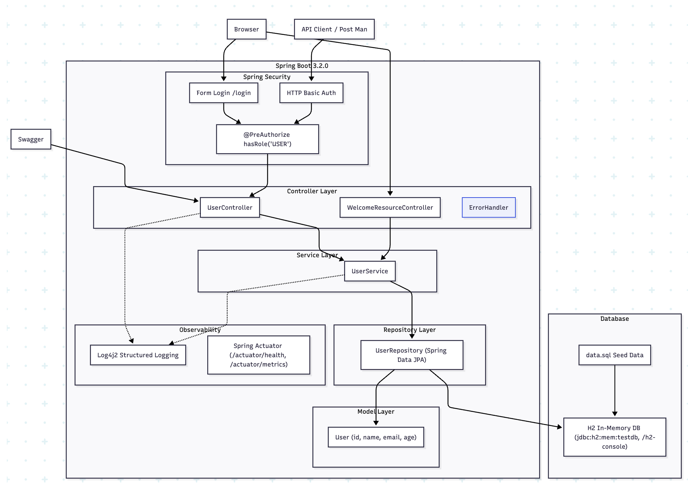

# Low Level Design — User Management REST API

> **Tekmetric Java Spring Boot Interview Exercise**  
> Version 1.0-SNAPSHOT · Spring Boot 3.2.0 · Java 21

---

## 1. Overview

This document describes the low-level design of the User Management REST API built as part of the Tekmetric Java Spring Boot backend coding exercise. The application exposes a versioned RESTful API for full CRUD operations on a User entity, backed by an in-memory H2 database, and includes additional production-grade enhancements beyond the base requirements.


---

## 2. Requirements

### 2.1 Functional Requirements
> ✅ **Required**

- Design a CRUD REST API with an in-memory H2 data store using Spring Boot
- API must expose one domain object (User) with the following operations:
  - **CREATE** — POST a new user
  - **READ (single)** — GET a user by ID
  - **READ (list)** — GET all users
  - **UPDATE** — PUT to update an existing user by ID
  - **DELETE** — DELETE a user by ID
- Provide SQL scripts for schema creation in `resources/data.sql`
- Demonstrate API functionality using an API client tool (curl / Swagger UI)

### 2.2 Non-Functional Requirements
> ✅ **Required**

- Structured request/response logging for observability
- Interactive API documentation via Swagger/OpenAPI
- Unit tests for controller layer using Mockito

> ⭐ **Nice to Have**

- API versioning for forward compatibility
- Role-based access control (Authentication & Authorization)
- Health and metrics monitoring via Spring Actuator
- Containerization via Docker

### 2.3 Out Of Scope
- Input data validation
- Duplicate data checking
- Pagination and Data sorting
- Data persistence from H2 Memory DB on application shutdown

---

## 3. Architecture & Design
User Management Interface design is mainly based on the  under lying design concepts.
- Layered architecture - Modern Webapps use this arcitecture extensively
- REST APIs - Recommended architecture for designing networked applications using HTTP
- Observability - This is been widely followed by all Modern applications 
- JPA - Spring annotation based and can be extended to use other databases like PLSQL etc.,
- System design :
  



### 3.1 Layered Architecture

The application follows a standard Spring Boot layered architecture pattern:

| Layer | Class | Responsibility |
|---|---|---|
| Controller | `UserController.java` | Handles HTTP requests, maps to service, returns ResponseEntity |
| Service | `UserService.java` | Business logic, validation, orchestration |
| Repository | `UserRepository.java` | Data access via Spring Data JPA / H2 |
| Model | `User.java` | JPA entity mapped to `users` table |
| Resource | `WelcomeResource.java` | Simple welcome endpoint (excluded from Swagger) |

### 3.2 Data Model — User Entity

The User entity is mapped to the `users` table in the H2 in-memory database via JPA annotations.

| Field | Type | Column | Notes |
|---|---|---|---|
| `id` | Long | id | Primary Key, Auto-generated (IDENTITY) |
| `name` | String | name | User's full name |
| `email` | String | email | User's email address |
| `age` | Integer | age | User's age |

---

## 4. REST API Endpoints

All endpoints are versioned under `/api/v1/users` and produce/consume `application/json`.

| Method | Endpoint | Description | Auth Required | Status Codes |
|---|---|---|---|---|
| `GET` | `/api/v1/users` | Retrieve all users | Yes (USER role) | 200 OK |
| `GET` | `/api/v1/users/{id}` | Retrieve user by ID | Yes (USER role) | 200, 404 |
| `POST` | `/api/v1/users` | Create a new user | Yes (USER role) | 201, 400 |
| `PUT` | `/api/v1/users/{id}` | Update user by ID | Yes (USER role) | 200, 404 |
| `DELETE` | `/api/v1/users/{id}` | Delete user by ID | Yes (USER role) | 204, 404 |

There are error handlers for URLs that are not supported by the application. Instead of page not found messages , specific error messages are returned to the user.
example : http://localhost:8080/api/v1/users/10 , http://localhost:8080/api/dummy


### 4.1 GET /api/v1/users — Retrieve All Users

Returns a JSON array of all users currently stored in the H2 database.

- **HTTP Method:** GET
- **Response Body:** JSON array of User objects
- **Success:** 200 OK
- Empty list returns `200 OK` with `[]`

### 4.2 GET /api/v1/users/{id} — Retrieve User by ID

Returns a single User object matching the given path variable ID.

- **HTTP Method:** GET
- **Path Variable:** `id` (Long)
- **Success:** 200 OK with User JSON body
- **Not Found:** 404 if no user with given ID exists

### 4.3 POST /api/v1/users — Create New User

Accepts a JSON request body representing a new User and persists it to H2. Returns the saved User including the auto-generated ID.

- **HTTP Method:** POST
- **Request Body:** `{ "name": "string", "email": "string", "age": number }`
- **Success:** 201 Created with saved User JSON body
- **Invalid Input:** 400 Bad Request

### 4.4 PUT /api/v1/users/{id} — Update Existing User

Updates all fields of an existing User identified by the path variable ID. First verifies the user exists (throws 404 if not), then saves updated data.

- **HTTP Method:** PUT
- **Path Variable:** `id` (Long)
- **Request Body:** `{ "name": "string", "email": "string", "age": number }`
- **Success:** 200 OK with updated User JSON
- **Not Found:** 404 if user does not exist

### 4.5 DELETE /api/v1/users/{id} — Delete User

Deletes the user identified by the given ID from the database.

- **HTTP Method:** DELETE
- **Path Variable:** `id` (Long)
- **Success:** 204 No Content (empty body)
- **Not Found:** 404 if user does not exist

---

## 5. Features Implemented

### 5.1 API Versioning

All user endpoints are versioned using URI path versioning under `/api/v1/`. This is implemented via the `@RequestMapping` annotation at the controller class level.

- **Strategy:** URI Path Versioning (`/api/v1/`)
- **Benefit:** Clear version contract, easy to maintain v2 alongside v1 in future
- **Implementation:** `@RequestMapping(value = "/api/v1/users")`

### 5.2 Structured Logging with Log4j2

The default Spring Boot Logback logging is replaced with Log4j2, which offers higher performance and richer configuration. SLF4J is used as the logging facade.

- **Dependency:** `spring-boot-starter-log4j2` (`spring-boot-starter-logging` excluded)
- **Logger:** `org.slf4j.Logger` via `LoggerFactory.getLogger()`
- **Log points:** Every endpoint logs request receipt and result (e.g., user count on GET all)
- **Format:** Structured messages with method, path, and relevant data

Example log output:
```
INFO  GET /api/v1/users - Retrieving all users
INFO  GET /api/v1/users - Found 3 users
```

### 5.3 OpenAPI Documentation (Swagger UI)

Interactive API documentation is provided via Springdoc OpenAPI (v2.3.0), which auto-generates an OpenAPI 3.0 specification from the controller annotations.

- **Dependency:** `springdoc-openapi-starter-webmvc-ui:2.3.0`
- **Swagger UI:** http://localhost:8080/swagger-ui.html
- **Raw OpenAPI JSON:** http://localhost:8080/v3/api-docs
- **Scoped to:** `com.interview.controller` package only (`WelcomeResource` excluded)

| Annotation | Purpose |
|---|---|
| `@Tag` | Groups all endpoints under 'User API' in the Swagger UI |
| `@Operation` | Provides summary and description per endpoint |
| `@ApiResponse` / `@ApiResponses` | Documents expected HTTP response codes |
| `@Parameter` | Describes path variables (`id`) |
| `@RequestBody` | Documents the request body structure |

### 5.4 Testing

#### 5.4.1 Automated Unit Testing and Integration Testing

Controller layer is tested using JUnit 5 and Mockito via the `@ExtendWith(MockitoExtension.class)` approach, isolating the controller from service dependencies.
Service layer is tested using the same approach and `@InjectMocks` for creating mocks and injecting them.
Repository layer is tested using `@DataJpaTest`. Annotation sets up H2 db, entity transaction management without overhead of service and controller to test in isolation.
User Integration test uses `@SpringBootTest` and `@AutoConfigureMockMvc` for loading spring context and test http endpoint without starting a real server. 

- **Test framework:** JUnit 5 + Mockito (via `spring-boot-starter-test`) , Authentication / Authorization using `spring-security-test`
- **Mocking:** `@Mock UserService`, `@InjectMocks`

#### 5.4.2 Manual Testing
- **PostMan API testing
- **Testing using curl

### 5.5 Authentication & Authorization

Spring Security is integrated to protect all User API endpoints with dual authentication support: form-based login for web browsers and HTTP Basic authentication for API clients. Role-based access control is enforced using the `@PreAuthorize` annotation with method-level security.

- **Dependency:** `spring-boot-starter-security`
- **Authentication Methods:**
  - **Form-Based Login:** Default for web browsers; redirects to `/login` page on unauthorized access
  - **HTTP Basic:** For API clients (e.g., Postman, curl); sends `Authorization: Basic <credentials>` header
- **Authorization:** All 5 CRUD endpoints require the `USER` role via `@PreAuthorize("hasRole('USER')")`
- **Default User:** `username: user`, `password: password`, `role: USER`
- **CSRF Protection:** Disabled for API compatibility (state-changing requests like POST/PUT/DELETE are allowed without tokens)
- **Responses:**
  - Unauthenticated requests return **401 Unauthorized**
  - Unauthorized role access returns **403 Forbidden**
- **Security configuration can be extended to support JWT or OAuth2**

### 5.6 Spring Boot Actuator

Spring Boot Actuator is included to provide production-ready operational endpoints for health checks and monitoring.

- **Dependency:** `spring-boot-starter-actuator`
- **Health check:** http://localhost:8080/actuator/health
- **Metrics:** http://localhost:8080/actuator/metrics
- **Info:** http://localhost:8080/actuator/info
- Useful for container health probes (Docker, Kubernetes readiness/liveness)


### 5.7 Containerization (Docker)

A Dockerfile is provided to package the application as a container image using Eclipse Temurin JDK 21 (replacing the deprecated `openjdk:21-jdk-slim` image).

- **Base image:** `eclipse-temurin:21-jdk-jammy`
- **Copies:** `target/interview-1.0-SNAPSHOT.jar` → `app.jar`
- **Exposes:** Port 8080
- **Build:** `docker build -t interview-app .`
- **Run:** `docker run -p 8080:8080 interview-app`

---

## 6. Database Configuration

### 6.1 H2 In-Memory Configuration

The application uses H2 as an in-memory database configured via `application.properties`:

```properties
spring.datasource.url=jdbc:h2:mem:testdb
spring.datasource.username=sa
spring.datasource.password=password
spring.h2.console.enabled=true
spring.jpa.defer-datasource-initialization=true
```

### 6.2 data.sql — Seed Data

The file `src/main/resources/data.sql` seeds sample users on application startup. The property `spring.jpa.defer-datasource-initialization=true` ensures the INSERTs run after Hibernate creates the schema (default `ddl-auto=create-drop` for H2).

```sql
INSERT INTO users (name, email, age) VALUES ('Alice Johnson', 'alice@example.com', 30);
INSERT INTO users (name, email, age) VALUES ('Bob Smith', 'bob@example.com', 25);
INSERT INTO users (name, email, age) VALUES ('Carol White', 'carol.white@example.com', 35);
```

### 6.3 H2 Console

- **URL:** http://localhost:8080/h2-console
- **JDBC URL:** `jdbc:h2:mem:testdb`
- **Username:** `sa` | **Password:** `password`

---

## 7. Key Dependencies

| Dependency | Scope | Purpose |
|---|---|---|
| `spring-boot-starter-web` | compile | REST API, embedded Tomcat |
| `spring-boot-starter-data-jpa` | compile | JPA/Hibernate ORM |
| `spring-boot-starter-security` | compile | Auth & Authorization *(Nice to Have)* |
| `spring-boot-starter-actuator` | compile | Health/metrics endpoints *(Nice to Have)* |
| `spring-boot-starter-log4j2` | compile | Structured logging *(Nice to Have)* |
| `springdoc-openapi-starter-webmvc-ui` | compile | Swagger UI / OpenAPI docs *(Nice to Have)* |
| `h2` | runtime | In-memory relational database |
| `postgresql` | runtime | Future production DB (not active) |
| `spring-boot-starter-test` | test | JUnit 5 + Mockito testing |

---

## 8. How to Run

### 8.1 Local (Maven)

```bash
# Build
mvn clean package -DskipTests

# Run
java -jar target/interview-1.0-SNAPSHOT.jar
```

| URL | Description |
|---|---|
| http://localhost:8080/api/welcome | Welcome endpoint |
| http://localhost:8080/api/v1/users | Users API (requires authentication) |
| http://localhost:8080/login | Login page (form-based) |
| http://localhost:8080/swagger-ui.html | Swagger UI |
| http://localhost:8080/h2-console | H2 Database Console |
| http://localhost:8080/actuator/health | Health check |

**Authentication:** Use `username: user`, `password: password` for both web login and API Basic Auth.

### 8.2 Docker

```bash
# Build JAR
mvn clean package -DskipTests

# Build image
docker build -t interview-app .

# Run container
docker run -p 8080:8080 interview-app

# Run detached
docker run -d -p 8080:8080 --name interview-app interview-app
```

---


## 9. Summary

| Feature | Status | Notes |
|---|---|---|
| CRUD REST API (User) | ✅ Required | All 5 endpoints implemented |
| H2 In-Memory Database | ✅ Required | Configured in `application.properties` |
| `data.sql` Seed Scripts | ✅ Required | Sample users pre-loaded on startup |
| API Versioning (`/api/v1/`) | ⭐ Nice to Have | URI path versioning |
| Structured Logging (Log4j2) | ⭐ Nice to Have | Request/response logging per endpoint |
| Swagger / OpenAPI Docs | ⭐ Nice to Have | Springdoc 2.3.0, UI + JSON spec |
| Spring Security (RBAC) | ⭐ Nice to Have | `@PreAuthorize` USER role on all endpoints |
| Spring Boot Actuator | ⭐ Nice to Have | Health, metrics, info endpoints |
| Unit Tests (Mockito) | ⭐ Nice to Have | Controller layer tested |
| Docker Support | ⭐ Nice to Have | `eclipse-temurin:21-jdk-jammy` base image |


## 10. References
- ** REST API - https://restfulapi.net/
- ** Spring - https://docs.spring.io/spring-boot/docs/3.2.0/reference/htmlsingle/
- ** H2 DB - https://www.h2database.com/html/main.html