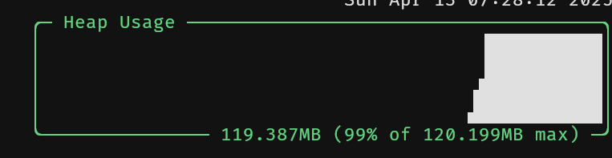
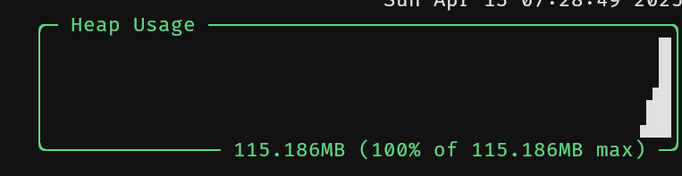

# Neo Data Analyser

## Running

```bash
$ ./bootstrap.sh (only once to bootstrap the environment)
$ uv run neo-data-analyser
```

## Testing

```bash
$ uv run pytest
```

### Benchmarks

Memory profiles two different cases:

#### 2000 Near earth objects



### 200 Near earth objects



