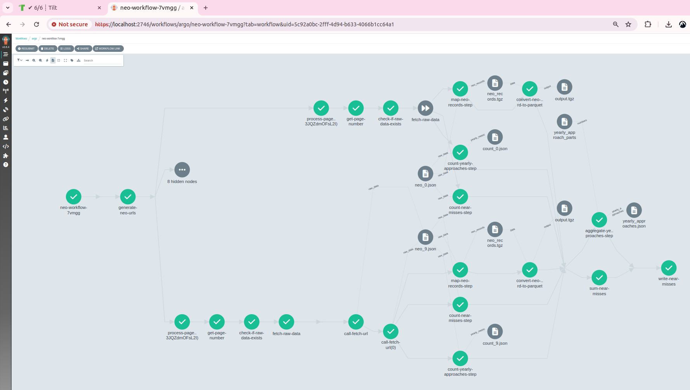
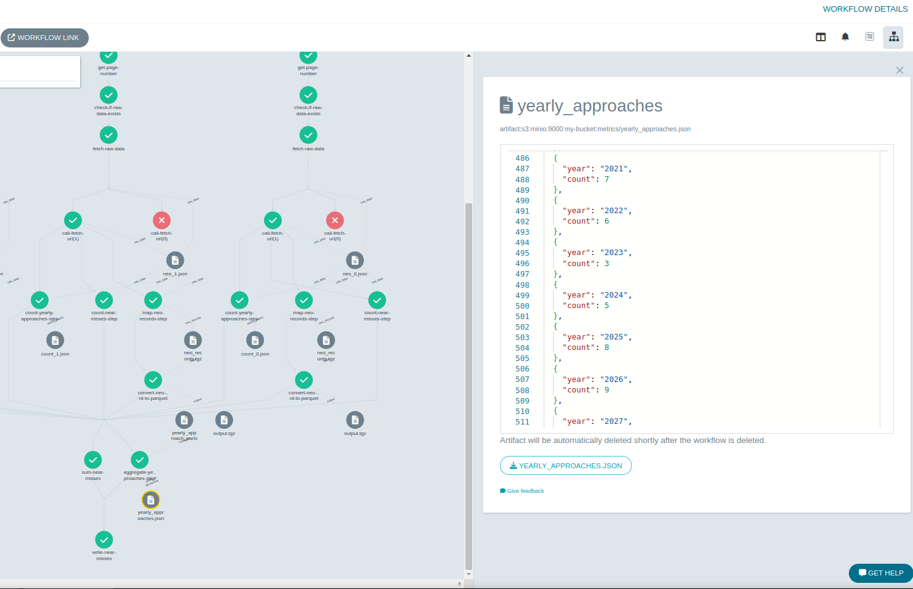

# Overview

This repository provides two implementations for processing and aggregating metrics from the NEO browse API data. The goal is
to demonstrate both a pure Python solution and a solution using a pipeline orchestrator, showcasing parallelism and modular
design.
Both solutions are for illustrative purposes and require additional work in a production scenario.

# Conceptual Solution

The core idea is to leverage parallelism by processing data per page (or groups of pages) independently, then
aggregating the results.

Since there is no dependency between individual metrics, the work can be divided into several stages:

1. Page Set Splitting:

   * Divide the pages into sets (e.g., pages 0–19, 20–49, etc.).
   * Granularity can be adjusted based on resource consumption, checkpointing, and scalability.
   * Optionally, assign a pool of API keys to increase parallelism.

2. Data Gathering:
    * Fetch raw data in parallel for each page set.

3. Metrics Processing:

    * Process metrics in parallel for each page set.
    * Define metrics in a generic way to allow flexible computations.

4. Aggregation

    * Combine results from all parallel tasks to produce overall metrics.

The chosen solution will depend on specific business needs, non-functional requirements, and the overall technology
landscape. Pipeline orchestrators such as Argo Workflows or Airflow are well-suited for batch jobs and tend to be less
complex, while tools like Spark, Kafka, or Flink—designed for stream processing—offer additional capabilities for
handling real-time data.

# Python solution

Since this was a Python coding exercise, a dedicated Python solution was developed.
In contrast to the alternative approach—which uses only a minimal amount of Python—this version employs it for all core
processing logic.
The code is structured to enable parallel execution across page sets, with results aggregated in a subsequent step.

This solution showcases an iterative development approach, using TDD with incremental, granular commits.
The design separates the functional core from the imperative shell.

## Improvements

Here are some potential enhancements for the solution:

1. **Data Processing Enhancements:**

    * **Using DataFrames:**
        Leverage dataframes to define generic transformations for metrics. For example:

    ```
    def apply_transformations(
        df: pd.DataFrame, transformations: list[callable]
    ) -> pd.DataFrame:
        """Apply transformations in sequence and return the resulting DataFrame."""
        if not transformations:
            return df
        return reduce(lambda acc, f: f(acc), transformations, df)

    def drop_columns(df: pd.DataFrame, columns: list[str]) -> pd.DataFrame:
        return df.drop(columns=columns)

    def rename_columns(df: pd.DataFrame, mapping: dict) -> pd.DataFrame:
        return df.rename(columns=mapping)
    ...
    ```
    * **Defining DTOs:**
        Alternatively, defining DTOs for API responses, processed data, and metrics can improve type safety and clarity. The best approach depends on the project's scope and future requirements.

    * Tests enable refactoring the code in either direction.

2. **Request Handling Enhancements:**

   * Parallelize HTTP requests using asynchronous libraries.
   * Incorporate retries and rate limiting to improve reliability.

3. **Robustness and Observability:**

    * Enhance error handling and logging.
    * Expand test coverage, add integration tests


## Project setup

Check [SETUP_PYTHON_PROJECT.md](SETUP_PYTHON_PROJECT.md)

# Argo Workflows solution

[Argo Workflows](https://argoproj.github.io/workflows/) is an open-source, container-native workflow engine designed for
orchestrating parallel jobs on Kubernetes. Implemented as a Kubernetes Custom Resource Definition (CRD), it provides
robust mechanisms for passing data between steps. Artifacts (files) are managed in an external repository (such as MinIO
or S3) and can be shared seamlessly among pods.


## Design Philosophy

Argo Workflows embraces the Unix philosophy of building small, modular components that do one thing well. Key design
features include:

* **Modularity:**
  Workflow steps are implemented as independent, reusable components. Entire workflows or individual steps can be shared
  across projects using WorkflowTemplates.

* **Minimal Coding:**
  In production, we might package processing code into Docker images to run as workflow steps. This POC demonstrates
  how the entire workflow can be orchestrated with minimal custom code by reusing existing tools.

## Main tools used

1. **Python:**

    * Minimal usage (generating a list of urls)

2. **[jq](https://jqlang.org/):**

    * jq is a lightweight and flexible tool for slicing, filtering, mapping, and transforming JSON data.
    * In this solution, it is used for:
      * Mapping API responses to Near Earth Object (NEO) records.
      * Computing metrics.
      * Aggregating metrics.

3. **curl:**

    * Utilized for fetching data from external APIs.

4. **[DuckDB](https://duckdb.org/):**

    * Employed to map JSON files into Parquet format

## High-Level Workflow Overview

1. URL Generation:

    * The workflow begins by generating a list of URLs that represent the different data pages to be processed.

2. Sub-Workflow Execution for Each URL:

   * For each URL generated in the first step, a sub-workflow is triggered.
   * Each sub-workflow is responsible for acquiring the raw data from the API and processing it into meaningful metrics.
     * Check if data exists on S3
     * Fetch if it doesn't exist
     * Map NEO records
     * Write NEO records to Parquet
     * Compute near misses
     * Compute yearly approaches
   * Mapping and metrics steps run in parallel

3. Metrics Aggregation:

   * Once all sub-workflows have completed, the main workflow aggregates the metrics produced by each sub-workflow into
     a final, consolidated result.


## Example Workflow Run

Below is an example screenshot illustrating a workflow run processing pages 0–9.

(Note: The fetch step is skipped for pages that have already been fetched, indicated by gray double arrow icon.)

In the following example, you can observe artifact outputs and retry behavior:

(Note: The fetch step succeeded upon retry, as indicated by the red failure icon that later resolves.)

## Conclusion

This Argo Workflows solution demonstrates how to build a scalable, modular, and efficient data processing pipeline with
minimal custom code. By leveraging a combination of lightweight tools and orchestrating them through Argo Workflows, the
solution highlights a practical approach to solving complex data processing tasks in a Kubernetes environment.

## Project setup

Check [SETUP_WORKFLOW.md](SETUP_WORKFLOW.md)
