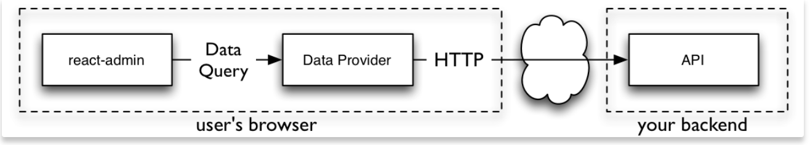
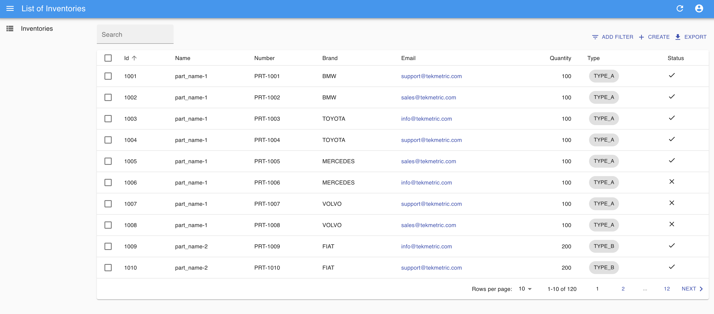
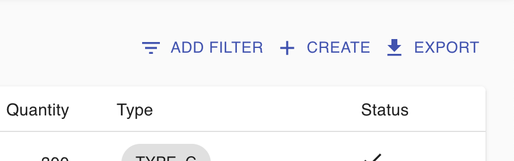
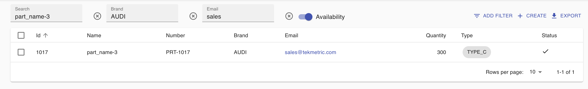
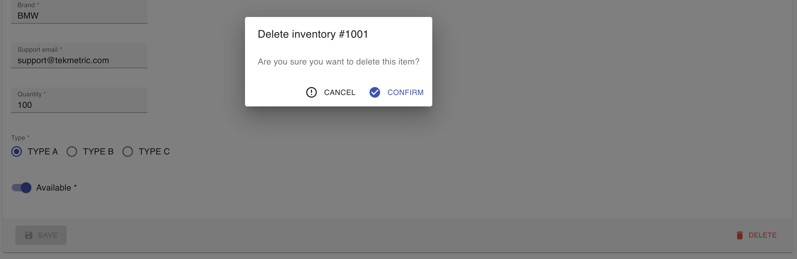
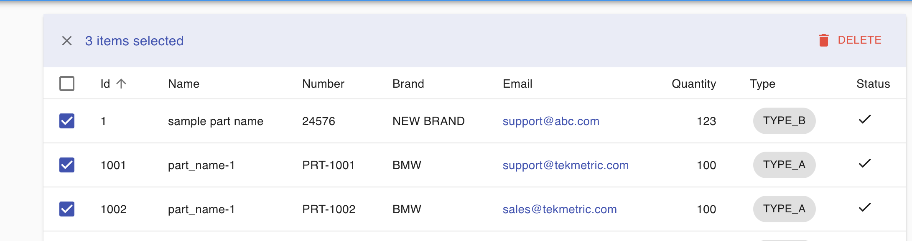
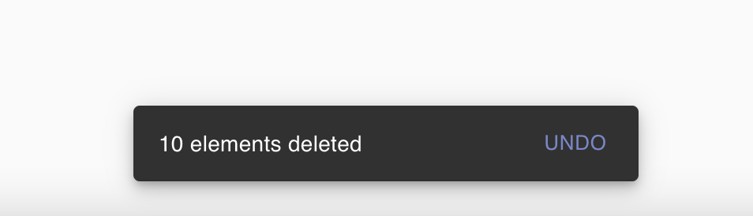
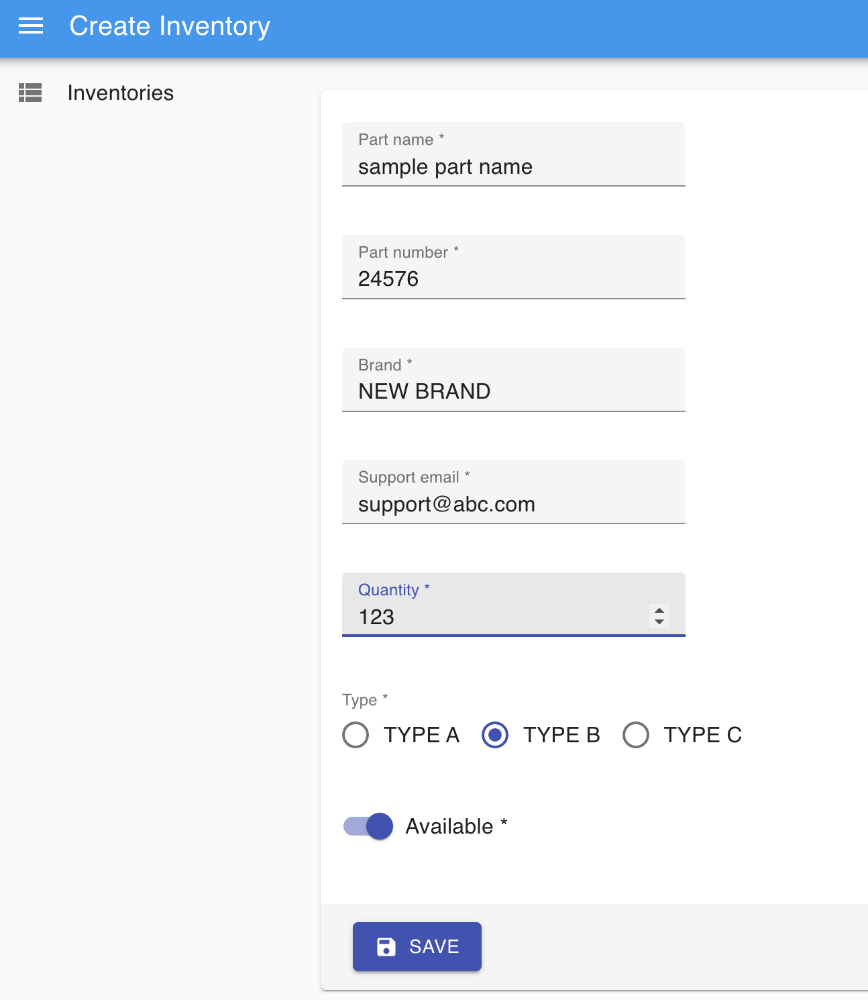

# Tekmetric Interview - FE Assignment

## Summary
This project is a client application for the "Tekmetric Interview - BE Assignment"

React-admin framework is used for this assignment.
It is a frontend Framework for building data-driven applications running in the browser, on top of REST/GraphQL APIs, using React and Material Design.

## How to Run Application
Run with yarn / npm:
you can run any of these commands `yarn start` or `npm start`

Run with Docker:
Docker file is under the root(frontend) directory. You can run the given commands below.
`docker build -t tektmetric:fe .` <br> `docker run -p 3000:3000 tektmetric:fe`

<br>

## Assigment Details
I have decided to use the react-admin framework because it is easy while building data-driven applications.
I have tried to reuse this framework for the requirements. it is suitable for CRUD operations, the data table and requires low code changes.

<br>

### Data Providers
Data Provider is an adapter for an API. I have created a custom data provider which is compatible with the Spring Boot BE application.




This is an example of "create" and "update" methods that are in the custom dataprovider.

````
update: (resource, params) =>
    httpClient(${apiUrl}/${resource}/${params.id}, {
    method: 'PUT',
    body: JSON.stringify(params.data),
}).then(({json}) => ({data: json})),

create: (resource, params) =>
    httpClient(${apiUrl}/${resource}, {
        method: 'POST',
        body: JSON.stringify(params.data),
}).then(({json}) => ({
    data: {...params.data, id: json.id},
})),
````
<br>

### List View
The List view displays a list of records fetched from the API, and allows users to filter, sort, select, and paginate the records.
For listing the inventories I have created InventoryList component with a data grid.

This is an example of inventory records in the data table.



<br>
I have added dynamic filters and search options to the table. Any filter can be added with the "ADD FILTER" option.



<br>
The search field is a default filter for the part names. Brand, Part Number, email, and status filters are optional fields for filtering.
You can see an example of the filtered results of inventory data.



<br>
For deletion inventory, if you can click any inventory in the table, the edit screen is opened and you can delete the selected inventory with the "DELETE" button.
You can see an example of deleting inventory with a confirmation dialog.



You can also select many items in the table and delete them together. The BE API supports multiple deletion operations.


Multiple delete operation is undoable in 5 seconds. The request is sent to the API after 5 seconds to prevent any errors.



<br>

### Create and Edit
For the create and delete operations I have created InventoryCreate and InventoryEdit components.

These components call the required dataProvider method, prepare the form submit handler, and render the page title and actions.
While creating a record all fields are required. I have added validations (required and email validation).

You can see an example of create inventory operation.

