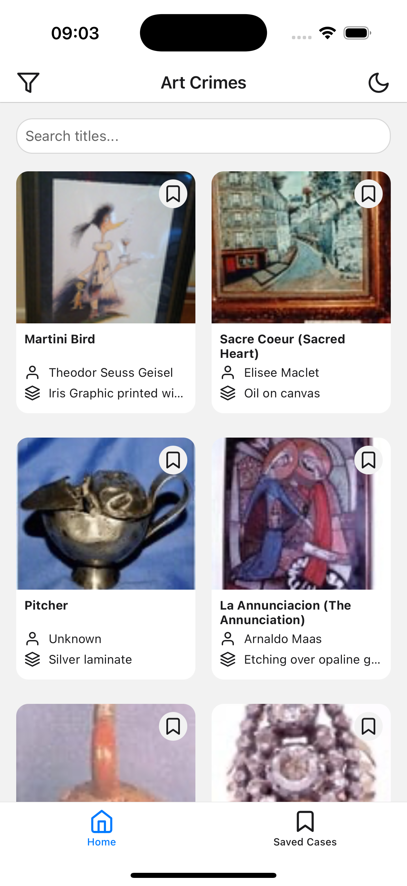
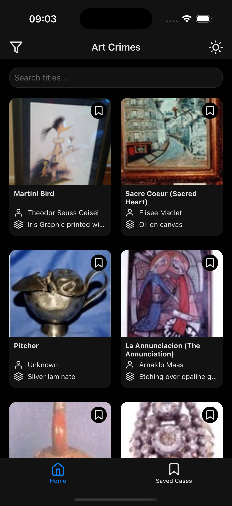
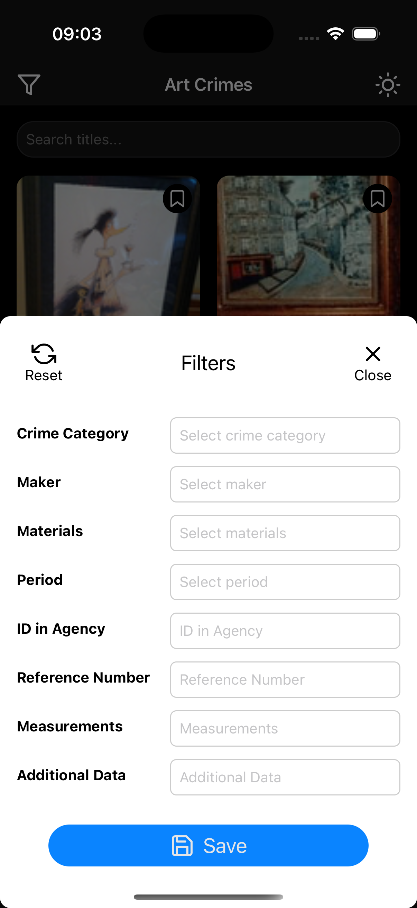
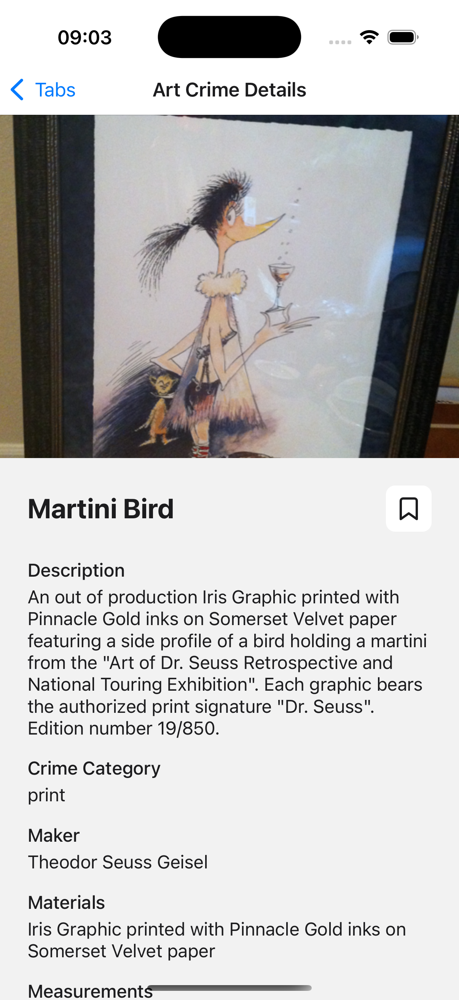
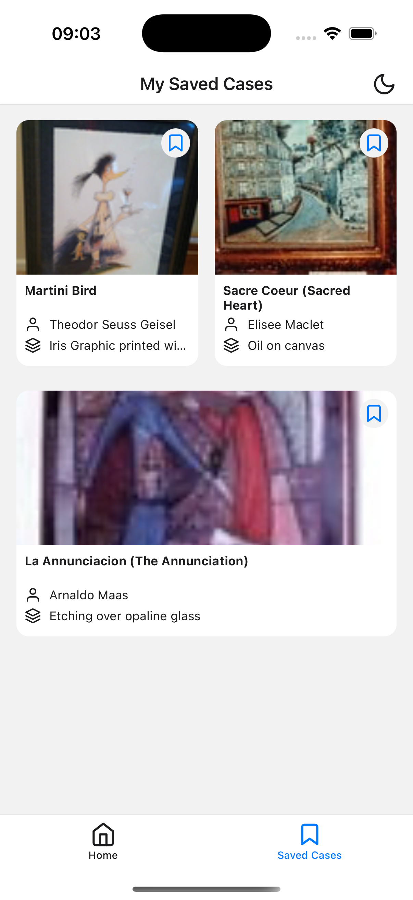
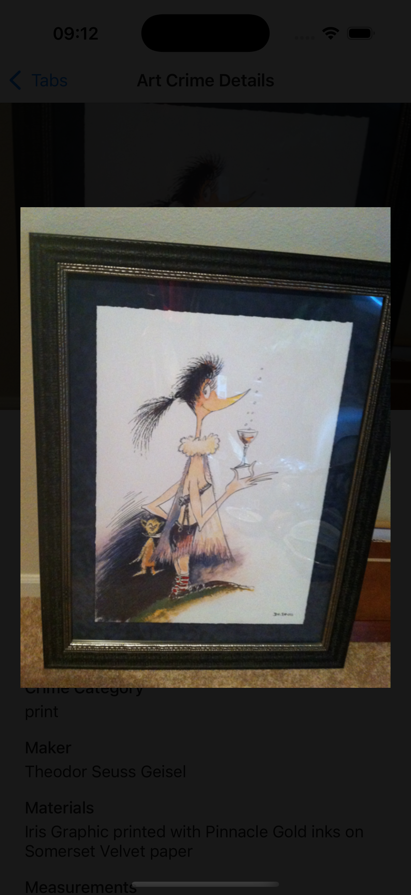

# FBI Art Crimes Finder

## 🚀 Steps to Get Started

### 🔧 Prerequisites

- Node.js (LTS version recommended)
- Expo CLI  
  Install if not already:
  ```bash
  npm install -g expo-cli
  ```
- A mobile device with the Expo Go app **or** an emulator (iOS Simulator/Android Emulator)

### 📱 Running the App

1. Install dependencies:

   ```bash
   npm install
   ```

2. Start the app:

   ```bash
   npx expo start
   ```

3. Run on your preferred platform:

   - Scan QR code with Expo Go app (physical device)
   - Press `i` for iOS Simulator
   - Press `a` for Android Emulator

### 🔍 API Choice

I chose the FBI Art Crimes API because:

- It provides a rich dataset with various metadata fields
- Includes images for visual representation
- Offers an interesting and unique subject matter
- Perfect for demonstrating list and detail views

API Documentation: [FBI Art Crimes API](https://api.fbi.gov/docs#/artcrimes)

> **Note:** The API has some limitations:
>
> - Rate limiting may apply and can result in a 24-hour ban if exceeded
> - Some image URLs might be broken or unavailable
> - Limited filtering and search capabilities

### 🎨 Implementation Details

The app includes several features:

- **Styling & Theme**

  - Used StyleSheet for consistent styling
  - Implemented a custom theme system
  - Added dark/light mode support

- **UI/UX Features**

  - Grid layout for art crimes display
  - Pull-to-refresh functionality
  - Infinite scroll implementation
  - Search by title functionality
  - Filtering capabilities

- **Navigation & Interaction**

  - Tab-based navigation
  - Long-press on items to view images
  - Detailed view screen for each art crime

- **Additional Features**
  - Ability to save favorite art crimes
  - Separate tab for viewing favorites

### 🧪 Testing & Linting

The project includes scripts for testing and linting:

```bash
# Run ESLint
npm run lint

# Run ESLint with auto-fix
npm run lint:fix

# Run tests
npm test
```

### 📸 Screenshots

<table>
  <tr>
    <td></td>
    <td></td>
    <td></td>
  </tr>
  <tr>
    <td align="center">_Home screen showing the grid layout</td>
    <td align="center">_App in dark mode with grid view_</td>
    <td align="center">_Search functionality and filtering options_</td>
  </tr>
  <tr>
    <td></td>
    <td></td>
    <td></td>
  </tr>
  <tr>
    <td align="center">_Detailed view of an art crime_</td>
    <td align="center">_Favorites tab showing saved art crimes_</td>
    <td align="center">_Full-screen image preview_</td>
  </tr>
</table>
