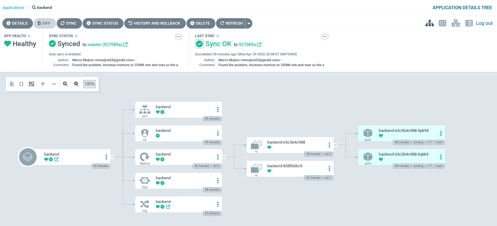

# General instructions to get the application running in K3S using argoCD and helm charts

## Directory Structure
> *the rest of the directories were omitted for brevity*
```
.
├── backend/                    # Application source code (Java/Spring Boot)
│   ├── Dockerfile              # Instructions for building the container image
│   └── pom.xml                 # Java dependencies and build configuration
├── .github/workflows/          # CI Pipeline: Automates building & pushing images to GHCR.io        
└── sre                          # Infrastructure & GitOps (The "Source of Truth")
    ├── argocd                   # Application Manifests (package helm chart to use to create the argoCD Application)
    │   ├── charts               # Sub-charts (e.g., application dependencies)
    │   ├── Chart.yaml           # backend helm chart definition yaml so argoCD knows the version and location of the chart
    │   └── values.yaml          # Default configuration values for the backend application k8s deployment
    ├── backend                  # Helm Chart: Templated K8s manifests (Deployment, SVC, Ingress, HPA, Ingress, etc.)
    │   ├── backend-0.0.1.tgz    # package produced using helm package backend
    │   ├── Chart.yaml           # backend helm chart definition yaml
    │   ├── templates            # helm chart templates folder
    │   └── values-testing.yaml  # values-testing.yaml is intentioanlly called -testing to avoid undesired default values
    ├── Instructions.md          # this file
    ├── monitoring               # Observability: Prometheus/Grafana Helm values and CRDs
    │   └── prometheus.yaml      # prometheus default configuration compatible with k3s
    └── README.md                # original project instructions.

```

## step by step configurations

* Download k3s https://docs.k3s.io/quick-start
* `sudo k3s server &`
* `helm repo add prometheus-community https://prometheus-community.github.io/helm-charts`
* `helm repo update`
* `helm install prometheus prometheus-community/kube-prometheus-stack --namespace monitoring --values sre/monitoring/prometheus.yaml`
* `kubectl create namespace argocd`
* `kubectl apply -n argocd --server-side --force-conflicts -f https://raw.githubusercontent.com/argoproj/argo-cd/stable/manifests/install.yaml`
* Connect your github repository to argoCD https://argo-cd.readthedocs.io/en/stable/user-guide/private-repositories/#private-repositories 
* `kubectl create namespace tekmetric`
* Allow the cluster to access your github repository to pull the container images 
  * `kubectl create secret docker-registry ghcr-login-secret --docker-server=ghcr.io --docker-username=GITHUB_USER_NAME_HERE    --docker-password=PUT_YOUR_GITHUB_PAT_HERE --namespace tekmetric`
* submit argoCD application using UI and selecting the `sre/argocd` folder https://www.redhat.com/en/blog/continuous-delivery-with-helm-and-argo-cd
* Application should be running in your K3S cluster
